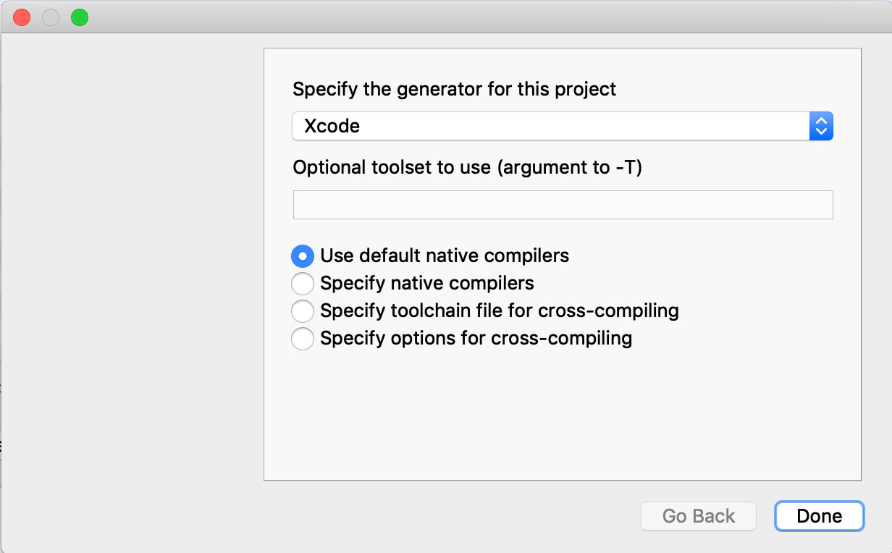
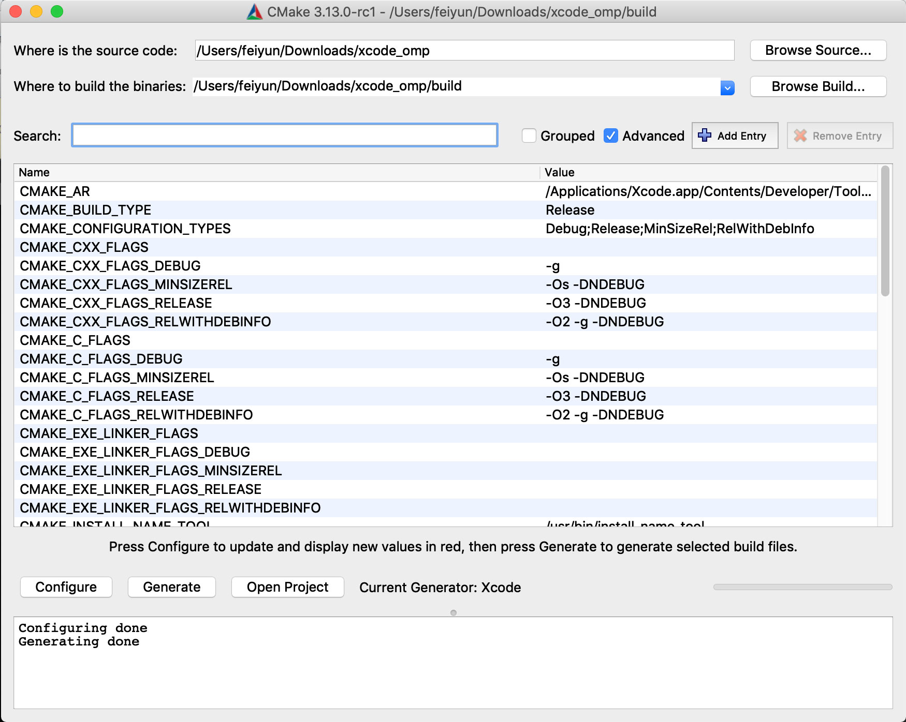
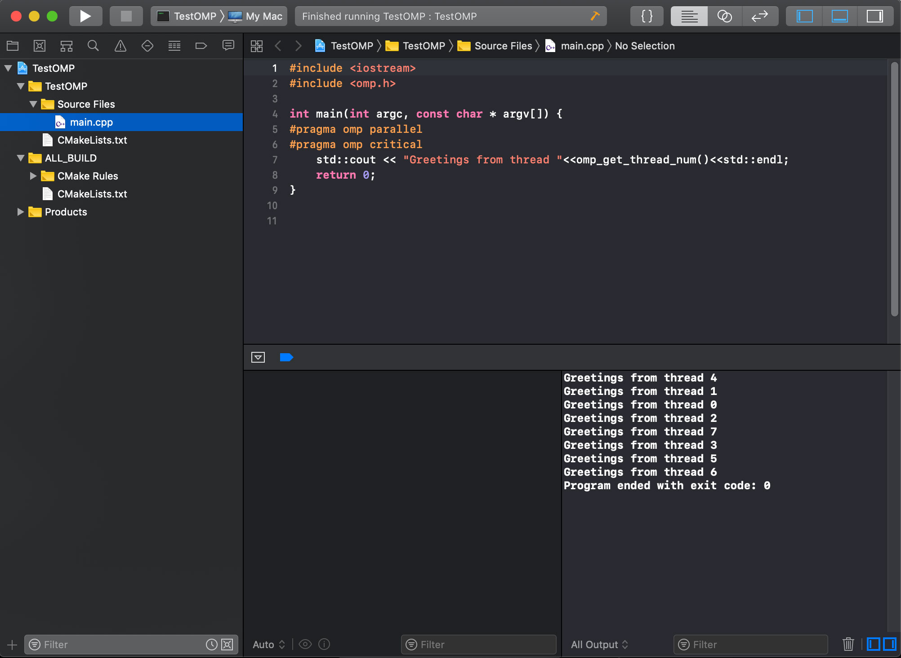

# CMakeLists Generating Xcode Project with OpenMP Support
This repository contains a CMakeLists.txt that can generate Xcode projects where the open source LLVM compiler (instead of the default Clang on Mac OS) is used for compilation, with OpenMP support. It generally follows [this post](http://antonmenshov.com/2017/09/09/clang-openmp-setup-in-xcode/) by Menshov for integration, where the sample code included is also borrowed from his post.

## Usage
1. Install the open source LLVM compiler with [Homebrew](https://brew.sh), with `brew install llvm` command in a terminal.
2. Download and install [CMake GUI](https://cmake.org/download/).
3. Download and install [libomp](https://mac.r-project.org/openmp/).
4. Open CMake GUI, point the source code to the folder containing this CMakeLists.txt, and use a subdirectory (say, "build", for example) to build the binaries.
5. Configure using Xcode generator. The CMakeLists.txt will use `/usr/local/opt/llvm` as the default root directory for the compiler. If Homebrew has installed the compiler into somewhere else, this root directory should be changed correspondingly.
6. Generate and open the Xcode project under the subdirectory to build the binaries.

## Screenshots
Select Xcode as the generator.


CMake GUI after configured


OpenMP can be used with the open source LLVM compiler under Xcode 10 and MacOS 10.14


## Details
There are two parts in the CMakeLists.txt that are necessary. The first part would find the compiler, include the directory containing OpenMP header and link with the OpenMP library, as following
```
set (LLVM_ROOT_DIR "/usr/local/opt/llvm")
find_package( LLVM )
if( LLVM_FOUND )
	include_directories (${LLVM_LIBRARY_DIRS}/clang/${LLVM_VERSION_BASE_STRING}/include)
	set ( CMAKE_CXX_FLAGS "${CMAKE_CXX_FLAGS} -fopenmp" )
	find_library(IOMP5LIB
		NAMES "iomp5" "iomp5md" "libiomp5" "libiomp5md" "libomp"
		HINTS ${LLVM_LIBRARY_DIRS})
	set (TESTOMP_LIBRARIES ${TESTOMP_LIBRARIES} ${IOMP5LIB})
endif( LLVM_FOUND )
```
where the `LLVM_ROOT_DIR` is the directory at which the open source LLVM compiler is located, provided by the user.

The second part would override the Xcode setting for compilers to use, and turn off the index-while-building feature (introduced since Xcode 9) that is incompatible with the open source LLVM compiler, as following
```
set_target_properties(<your target name> PROPERTIES XCODE_ATTRIBUTE_CC ${LLVM_ROOT_DIR}/bin/clang)
set_target_properties(<your target name> PROPERTIES XCODE_ATTRIBUTE_CXX ${LLVM_ROOT_DIR}/bin/clang)
set_target_properties(<your target name> PROPERTIES XCODE_ATTRIBUTE_COMPILER_INDEX_STORE_ENABLE "No")
```